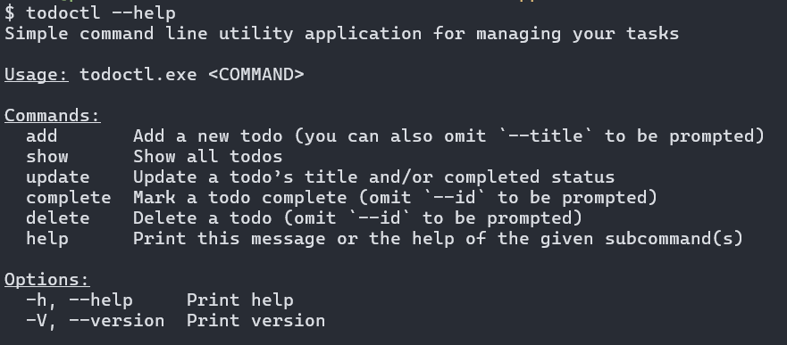
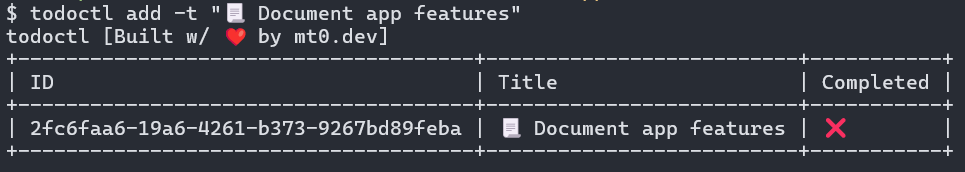
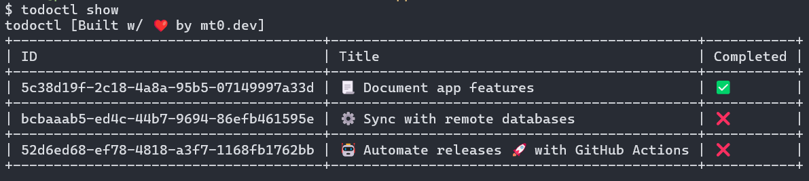

# `todoctl` 
CLI Application for managing tasks in the terminal

## Installation

```sh
cargo install --git https://github.com/MikeTeddyOmondi/todoctl
```

## Preview

### Displaying the help menu



### Adding a todo



### Showing all todos


